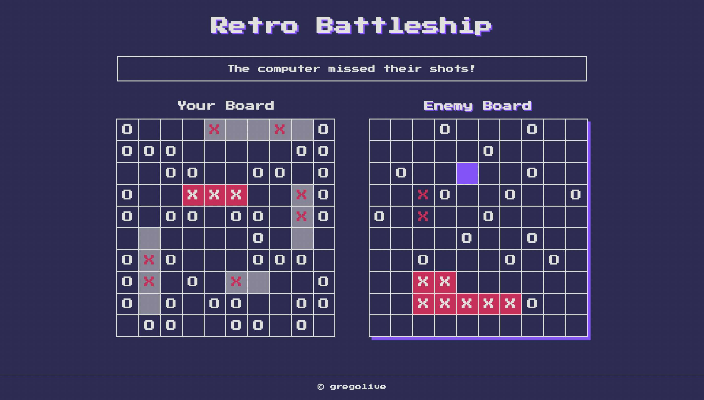

# Retro Battleship

Take to the high seas and test your luck against the computer in this classic guessing game.

[Live demo](https://gregolive.github.io/battleship/) 👈

## Functionality

- The game starts by a player choosing from one of three game modes: easy (computer has 1 guess per turn), medium (2 computer guesses), or hard (3 computer guesses)
- Players place 5 ships on their board with the option to rotate between 0 and 90 degrees and then the player and computer player take turns making guesses on the opponents board
- When a guess misses a white 'O' appears on the board and when a guess hits a red 'X' appears
- If all pieces of a ship are hit the sunken ship appears with a red background and white 'X's
- In between turns the dialog box above the screen updates the player with the results of the computer's turn
- Once a player sinks all 5 of their opponent's ships the game is over and the player is presented with the option to play again

## Reflection

The goal of this project was to create an app using Test Driven Development (TDD). Testing was completed using JavaScript testing framework **Jest**. Testing was completed for the app's factory functions and classes, not DOM methods, so the logic was seperated accordingly.Factory functions were implemented for ships and gameboards, while players were templated using Javascript classes so that the computer class could be extended more easily.

One of the most difficult parts of using TTD without testing DOM manioulation was separating the logic in an efficient way. There were a few times when I found myself having to write more lines of code in order to properly keep any DOM related methods outside of a class or factory function. Once they were seperated, however, the code was easier to understand and troubleshoot and this process helped me to understand the benefits of balancing conciseness and readability when writing code.

## To Add

- Logic to the computer player that allows it to guess around guesses that hit, but did not sink a ship
- A 2 player option that hides the opponents board between turns 

## Screenshot

